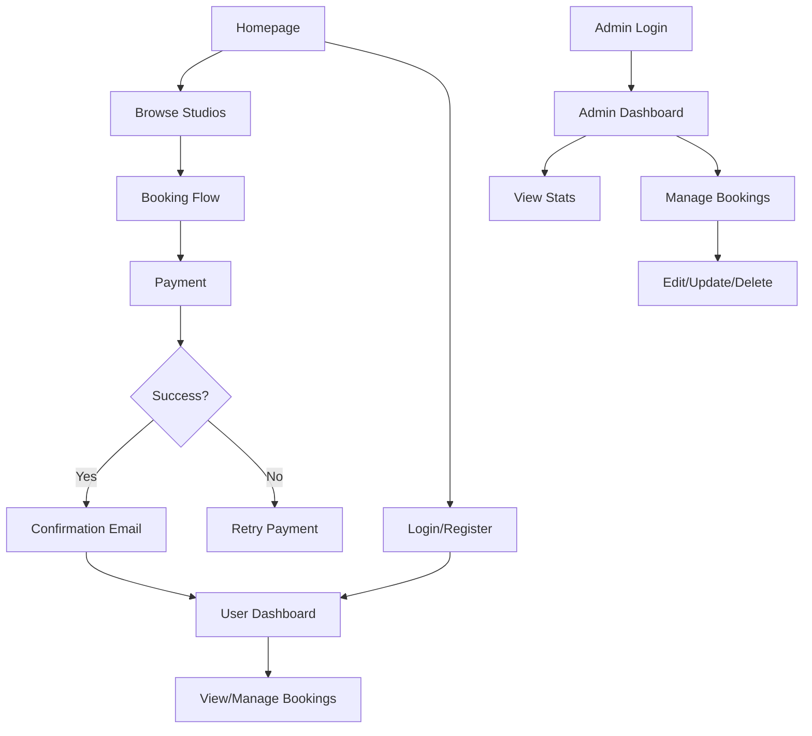

# Studio Leish - User Flow Document

## Overview
This document outlines the user flows for Studio Leish, a creative studio space booking platform. The application supports two main user types: **Customers** and **Administrators**.

---

## 1. Customer User Flows

### 1.1 Browse Studios Flow
```
Start → Homepage (index.html) → Gallery/Spaces (gallery.html) → View Studio Details → Start Booking
```

**Steps:**
1. User lands on homepage showcasing available studios
2. User clicks "Browse Spaces" or navigates to gallery.html
3. User views studio options with details (pricing, capacity, amenities)
4. User selects a studio to book
5. Redirects to booking page (book.html)

---

### 1.2 Booking Flow (6-Step Process)
**Page:** `book.html`

```
Step 1: Room Selection → Step 2: Date/Time → Step 3: Session Type → 
Step 4: Add-ons → Step 5: Customer Details → Step 6: Payment/Confirmation
```

#### Step 1: Room Selection
- User selects desired studio room
- Views room details, capacity, hourly rate
- Clicks "Next" to proceed

#### Step 2: Date & Time Selection
- Uses Flatpickr date picker to select date
- Selects time slot (start time and duration)
- System checks availability via Supabase
- Clicks "Next" to proceed

#### Step 3: Session Type
- Selects session type (Photography/Podcast/Video/etc.)
- Views pricing based on session type
- Clicks "Next" to proceed

#### Step 4: Add-ons
- Optionally selects add-ons (equipment, props, extra services)
- Pricing updates dynamically
- Clicks "Next" to proceed

#### Step 5: Customer Details
- **Guest User:** Enters name, email, phone number
- **Registered User:** Auto-filled if logged in
- Agrees to terms and conditions
- Clicks "Next" to proceed

#### Step 6: Payment & Confirmation
- Reviews booking summary
- Clicks "Proceed to Payment"
- Redirects to Billplz payment gateway
- **On Success:** Receives confirmation email via Resend
- **On Failure:** Shown error message, can retry

---

### 1.3 User Registration/Login Flow
**Page:** `user.html`

```
Start → user.html → [Register] or [Login] → [Email/Password] or [Google OAuth] → Dashboard
```

**Registration Steps:**
1. User clicks "Create Account"
2. Enters email, password, confirm password
3. Submits registration via Supabase Auth
4. Receives verification email (if enabled)
5. Redirects to user dashboard

**Login Steps:**
1. User enters email and password
2. Or clicks "Continue with Google" for OAuth
3. Supabase Auth validates credentials
4. On success, redirects to user dashboard
5. On failure, displays error message

---

### 1.4 User Dashboard Flow
**Page:** `user-dashboard.html`

```
Login → user-dashboard.html → View My Bookings → [View Details] / [Cancel Booking]
```

**Features:**
- View all user's bookings in a list/table
- Filter by status (upcoming, completed, cancelled)
- Click booking to view full details
- Cancel upcoming bookings (if allowed)
- View booking reference numbers

---

## 2. Administrator Flows

### 2.1 Admin Login Flow
**Page:** `admin.html`

```
Start → admin.html → Admin Authentication → Admin Dashboard
```

**Authentication:**
- Admin credentials verified via Supabase Auth (admin role check)
- Only authorized users can access admin dashboard

---

### 2.2 Admin Dashboard Flow
**Page:** `admin.html`

```
Dashboard → View Stats → Manage Bookings → [Search/Filter] → [Edit/Delete/Update Status]
```

**Dashboard Stats:**
- Total bookings count
- Pending bookings count
- Total revenue (completed payments)
- Recent booking activity

**Booking Management:**
1. **View All Bookings:** Table listing all bookings with details
2. **Search:** Search by customer name, email, or booking reference
3. **Filter:** Filter by date range, status, studio room
4. **Edit Booking:** Update booking details, date, or status
5. **Update Status:** Mark as confirmed, completed, cancelled, or no-show
6. **Delete Booking:** Remove cancelled/erroneous bookings

---

## 3. Payment Flow

### 3.1 Payment Processing
**Integration:** Billplz API

```
Booking Confirmation → Create Bill (api/billplz-create-bill.js) → 
Redirect to Billplz → [User Pays] → Callback (api/billplz-callback.js) → 
Update Supabase → Send Email Confirmation (Resend)
```

**Payment Steps:**
1. User clicks "Pay Now" on booking summary
2. Frontend calls `/api/billplz-create-bill.js`
3. Serverless function creates bill in Billplz
4. User redirected to Billplz payment page
5. User completes payment (FPX, credit card, etc.)
6. Billplz sends webhook to `/api/billplz-callback.js`
7. Callback function updates booking status in Supabase
8. Resend API sends confirmation email to customer
9. User redirected to success page

---

## 4. Error Handling Flows

### 4.1 Payment Failure
```
Payment Failed → Display Error Message → [Retry Payment] or [Contact Support]
```

### 4.2 Booking Conflict
```
Time Slot Unavailable → Show Alternative Slots → [Reselect Time] or [Choose Different Date]
```

### 4.3 Authentication Errors
```
Login Failed → Display Error (Invalid credentials/Account not found) → [Retry] or [Register]
```

---

## 5. User Flow Diagram (Mermaid)



---

## 6. Technology Integration Points

| Flow Step | Technology | Purpose |
|-----------|------------|---------|
| Authentication | Supabase Auth | User login, registration, session management |
| Booking Storage | Supabase (PostgreSQL) | Store booking data, user data, availability |
| Payment | Billplz API | Process payments, handle callbacks |
| Email Notifications | Resend API | Send booking confirmations, notifications |
| Date Picker | Flatpickr | Calendar UI for date/time selection |
| Hosting | Vercel | Static site hosting, serverless API functions |

---

## 7. Mobile Responsiveness

All flows are designed to work on:
- Desktop (1024px+)
- Tablet (768px - 1023px)
- Mobile (320px - 767px)

The booking flow uses a step-by-step wizard that adapts to smaller screens with simplified layouts and touch-friendly controls.

---

## 8. Future Enhancements

- **Review/Rating System:** Users can rate studios after sessions
- **Custom Domain:** Migration to studios.leish.my
- **Google OAuth Testing:** Complete OAuth integration testing
- **Membership Tiers:** Recurring booking discounts
- **Calendar Sync:** Add bookings to Google Calendar/Outlook

---

*Last Updated: May 2026*
